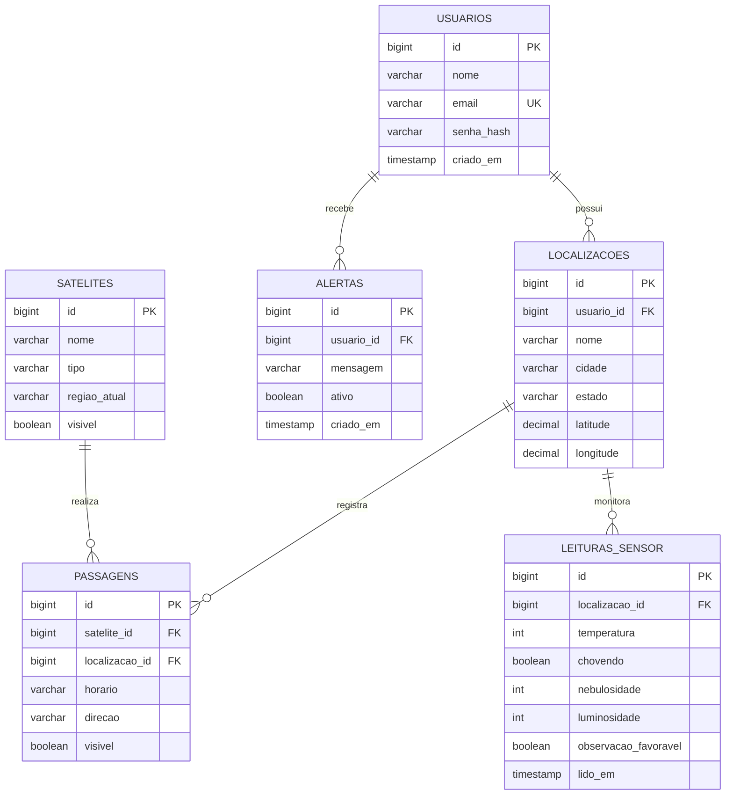

# Diagrama Entidade-Relacionamento (ER)

Projeto **"Tem Satélite Passando Por Mim Agora?"** — Global Solution FIAP.

## Relacionamentos

| Relacionamento | Cardinalidade |
|----------------|---------------|
| Usuario → Localizacao   | 1:N |
| Localizacao → Passagem  | 1:N |
| Satelite → Passagem     | 1:N |
| Usuario → Alerta        | 1:N |
| Localizacao → LeituraSensor | 1:N |

## Diagrama (Mermaid)

> O bloco abaixo é renderizado automaticamente no GitHub, no VS Code (com a
> extensão Mermaid) ou em https://mermaid.live



## Diagrama (texto / ASCII)

```
                         +------------------+
                         |     USUARIOS     |
                         +------------------+
                         | id (PK)          |
                         | nome             |
                         | email (UK)       |
                         | senha_hash       |
                         | criado_em        |
                         +--------+---------+
                            1 |   |   | 1
              +---------------+   |   +-----------------+
              | N                 | N                   |
     +--------v--------+   +------v---------+           |
     |  LOCALIZACOES   |   |    ALERTAS     |           |
     +-----------------+   +----------------+           |
     | id (PK)         |   | id (PK)        |           |
     | usuario_id (FK) |   | usuario_id(FK) |           |
     | nome            |   | mensagem       |           |
     | cidade / estado |   | ativo          |           |
     | latitude/long.  |   | criado_em      |           |
     +--+-----------+--+   +----------------+           |
      1 |         1 |                                    |
        | N         | N                                  |
+-------v------+  +-v-----------------+                  |
|  PASSAGENS   |  |  LEITURAS_SENSOR  |                  |
+--------------+  +-------------------+      +-----------v------+
| id (PK)      |  | id (PK)           |      |    SATELITES     |
| satelite_id  |  | localizacao_id(FK)|      +------------------+
|   (FK) ------+--|-------------------+----->| id (PK)          |
| localizacao_ |  | temperatura       |  N   | nome             |
|   id (FK)    |  | chovendo          |      | tipo             |
| horario      |  | nebulosidade      |   1  | regiao_atual     |
| direcao      |  | luminosidade      |      | visivel          |
| visivel      |  | observacao_fav.   |      +------------------+
+--------------+  | lido_em           |
                  +-------------------+
```
